☕ **Coffee O'Clock** - Modern React E-Commerce UI
A sleek, responsive coffee shop web application built with React. This project focuses on a high-end "dark mode" aesthetic, utilizing reusable components and efficient state management for a premium shopping experience.

🚀 **Features**
Dynamic Product Catalog: A modular grid system displaying various coffee blends with hover effects and detailed descriptions.
Interactive Cart System: Real-time updates for adding/removing items with a dedicated checkout preview.
Full Auth UI: Beautifully designed, functional forms for User Login and Account Creation.

## 📱 App Screenshots

| Home Page | Home Page | Home Page |About Page | 
|---|---|---|---|
| 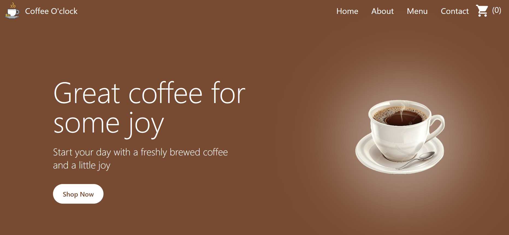 | 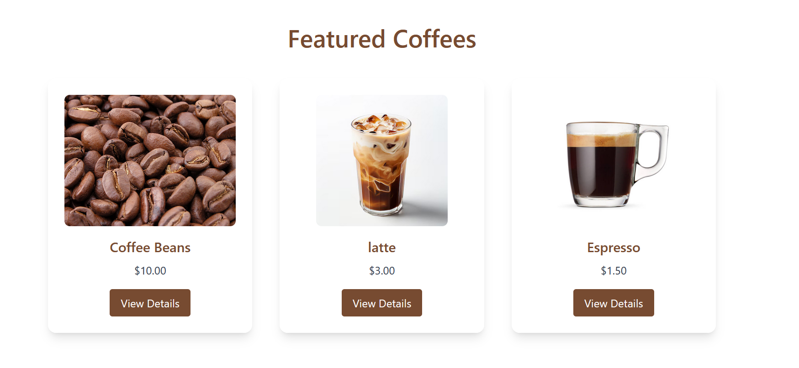 | 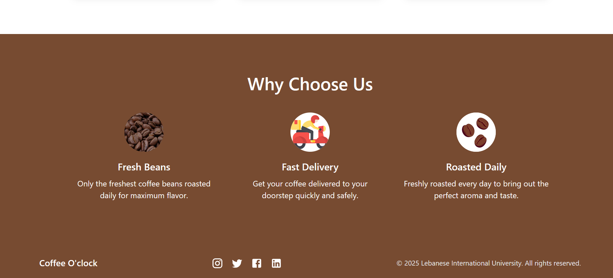 | 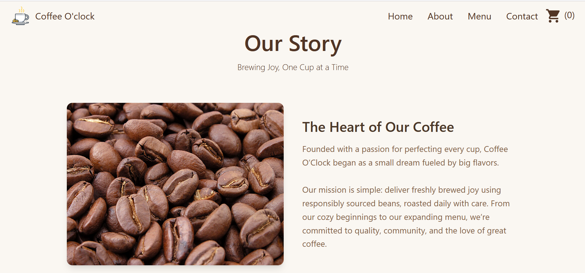 |

| Product Details | Menu | Contact  |
|---|---|---|
 | 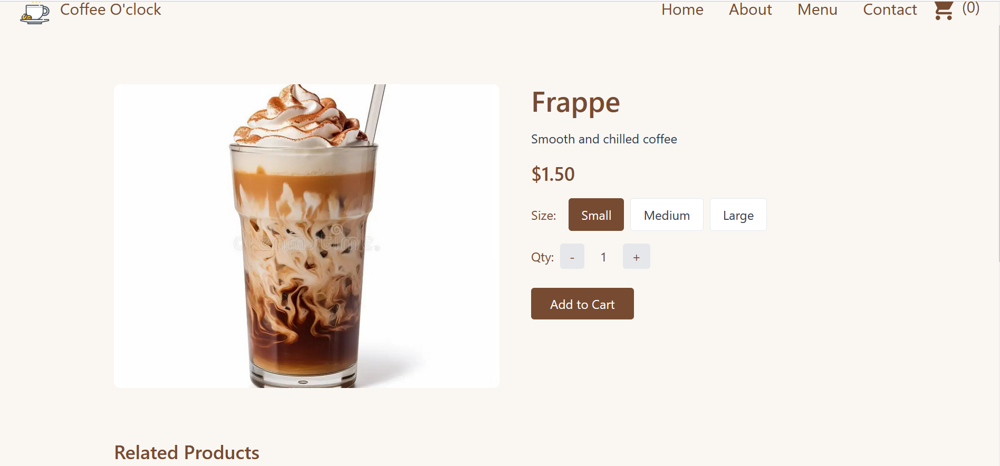 | 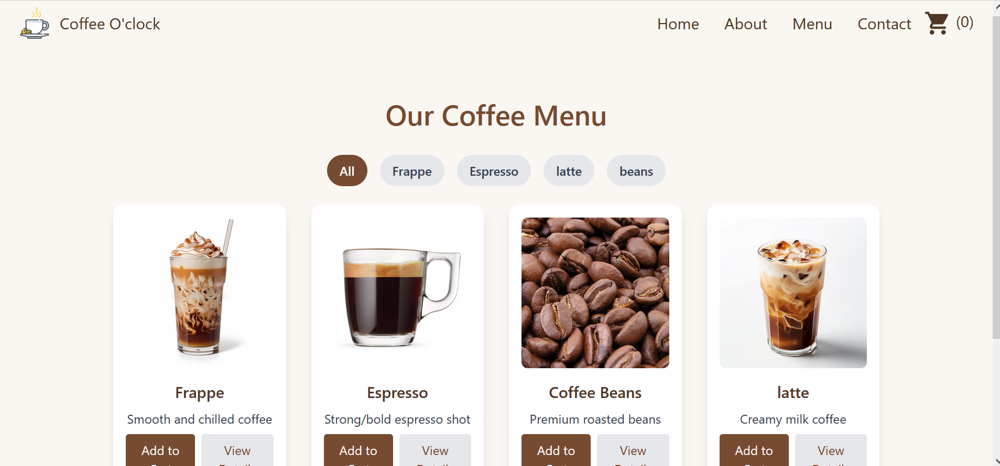 | 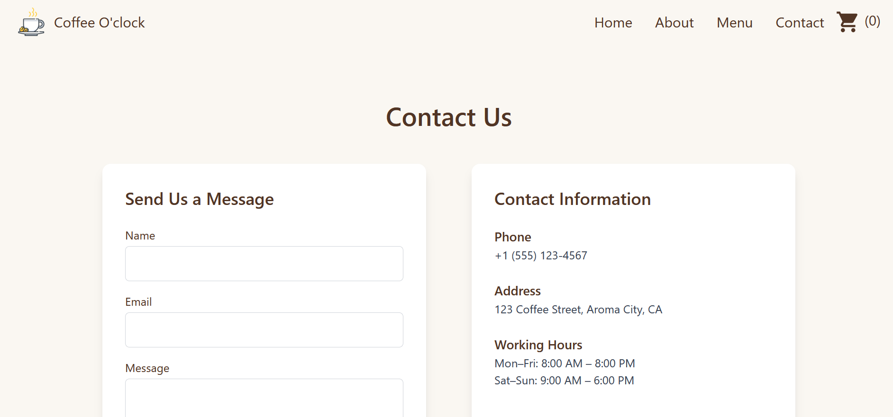 |
 
| Login | Cart | Signup | Profile |
|---|---|---|---|
| 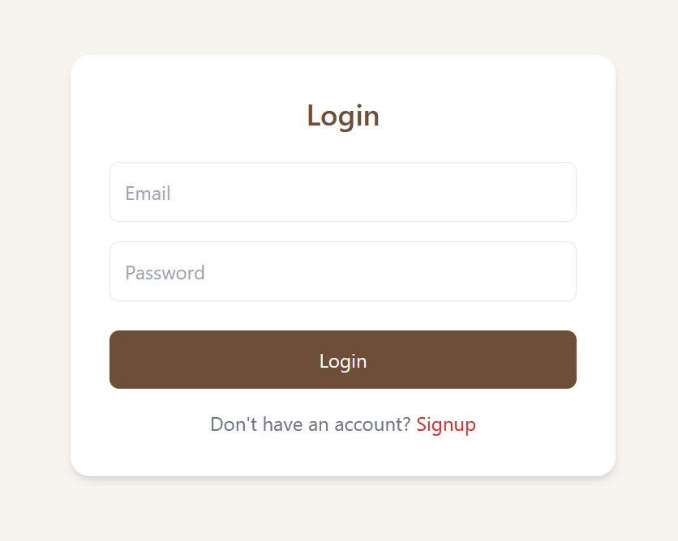 | 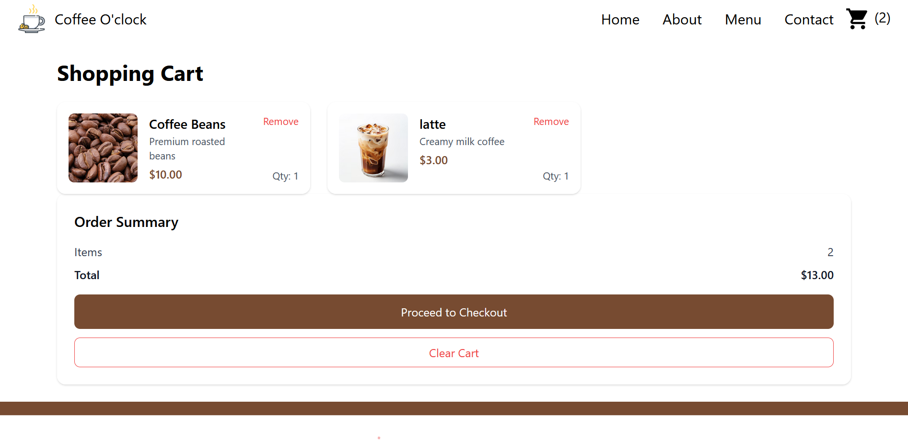 | 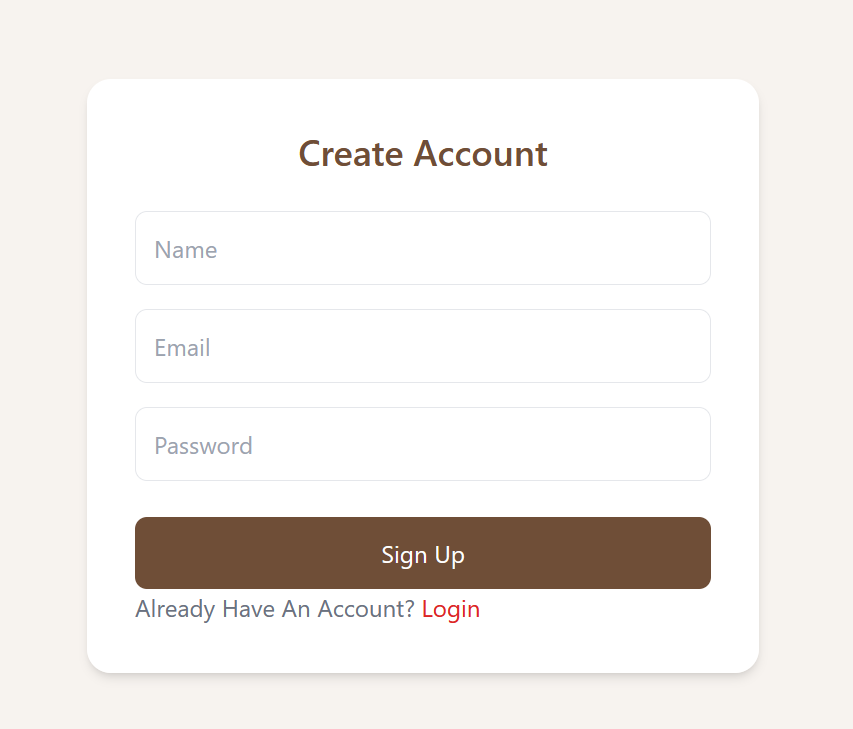 |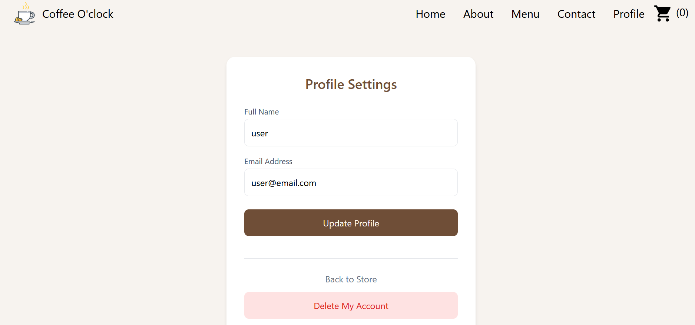 |
